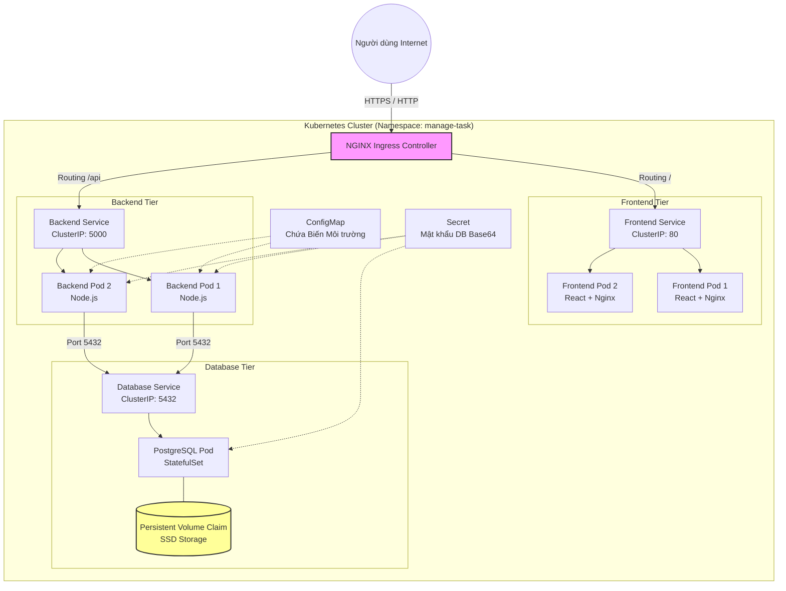

# Software & Infrastructure Requirements

Dự án: "DevOps Task Tracker"

## 1. Tổng Quan Dự Án (Project Overview)
Mục tiêu của dự án là xây dựng một hệ thống quản lý công việc (Task Tracker) theo mô hình 3-tier (Frontend - Backend - Database). Dự án này đóng vai trò như một môi trường thực tế thu nhỏ để thực hành đưa code từ Local lên Production tự động thông qua CI/CD Pipeline và vận hành trên hạ tầng Cloud (AWS).

## 2. Stack Công Nghệ Yêu Cầu (Tech Stack)
- **Frontend (FE):** ReactJS (hoặc Vue) dùng để build ra các file tĩnh gồm HTML, CSS, JS.
- **Backend (BE):** Node.js với framework Express, được đóng gói bằng Docker.
- **Database (DB):** PostgreSQL (Cơ sở dữ liệu quan hệ).
- **Hạ tầng Cloud:** Amazon Web Services (AWS).

## 3. Yêu Cầu Ứng Dụng (Application Requirements)

### Cấu trúc Cơ sở dữ liệu (Database Schema)
Yêu cầu khởi tạo một bảng duy nhất mang tên `tasks`. Bảng này bao gồm các trường dữ liệu sau:
- `id`: Khóa chính tự tăng.
- `title`: Tên công việc (Định dạng text).
- `status`: Trạng thái công việc pending/completed (Định dạng boolean).
- `created_at`: Thời gian tạo công việc.

### Giao diện Người dùng (Frontend UI)
Giao diện ứng dụng phải bao gồm:
- 1 ô input để nhập nội dung task và 1 nút "Thêm". 
- Phía dưới là một danh sách hiển thị các task hiện có, mỗi task đi kèm một nút Check (để đánh dấu hoàn thành) và một nút Xóa. 
- Khi người dùng thao tác trên giao diện, Frontend phải gọi chính xác các API tương ứng từ Backend.

### Đầu mối API (Backend API Endpoints)
Backend cần cung cấp 4 API cơ bản kết nối trực tiếp với Database:

| Phương thức HTTP | Endpoint | Chức năng Yêu cầu |
| --- | --- | --- |
| GET | `/tasks` | Truy vấn DB và trả về toàn bộ danh sách công việc. |
| POST | `/tasks` | Nhận dữ liệu từ FE gửi lên và thêm công việc mới vào DB. |
| PUT | `/tasks/:id` | Cập nhật trạng thái hoàn thành của một công việc cụ thể. |
| DELETE | `/tasks/:id` | Xóa một công việc khỏi DB dựa trên ID. |

## 4. Yêu Cầu DevOps & Hạ Tầng (DevOps & Infrastructure Requirements)

### Bảo mật và Cấu hình Ứng dụng
- **Biến môi trường (Environment Variables):** Code Backend tuyệt đối không được hardcode thông tin kết nối Database. Bắt buộc phải đọc qua biến môi trường (ví dụ: `DB_HOST`, `DB_USER`, `DB_PASS`) để đảm bảo tính linh hoạt và bảo mật khi deploy lên ECS Fargate.
- **Xử lý CORS:** Backend phải được cấu hình cấp phép cho domain của Frontend (nằm trên CloudFront) gọi API. Nếu thiếu cấu hình này, trình duyệt sẽ chặn kết nối khi chạy trên môi trường Cloud.

### Kiến trúc Hạ tầng Đám mây (AWS Provisioning)
- **Amazon S3 & CloudFront:** Dùng S3 Bucket để lưu trữ các file tĩnh của Frontend và dùng CloudFront để phân phối nội dung ra internet.
- **Amazon RDS:** Dùng để khởi tạo và chạy instance Database PostgreSQL.
- **Amazon ECR:** Kho lưu trữ để chứa Docker Image của Backend sau khi build.
- **Amazon ECS (Fargate):** Thiết lập Task Definition để chạy container Backend mà không cần quản lý máy chủ vật lý.
- **ALB & Route 53:** Cấu hình Application Load Balancer và DNS Route 53 để nhận diện và điều hướng traffic từ người dùng vào đúng container đang chạy.

### Luồng Triển khai Tự động (CI/CD Pipelines)
- **Quản lý Mã nguồn:** Mã nguồn phải được quản lý trên GitHub hoặc GitLab. Bắt buộc thiết lập Branch Protection Rule để chặn push thẳng lên nhánh chính, mọi thay đổi phải qua bước review.
- **Pipeline Frontend:** Kịch bản tự động bao gồm: cài đặt thư viện, chạy lệnh build đóng gói code, đẩy file lên S3, và gọi lệnh Invalidation trên CloudFront để xóa bộ nhớ đệm (cache).
- **Pipeline Backend:** Kịch bản tự động bao gồm: kéo code mới nhất, chạy test, build Docker Image, đẩy Image lên kho ECR, và gọi API báo cho ECS chạy container mới.

## 5. Yêu Cầu Vận Hành & Giám Sát (Operations & Monitoring)
- **Giám sát Hệ thống:** Bắt buộc tích hợp CloudWatch để thu thập và xem log của ứng dụng, giúp phát hiện lỗi khi chạy trên môi trường thực tế.
- **Tự động hóa Hạ tầng (IaC):** Khuyến khích tập viết Infrastructure as Code bằng Terraform hoặc CloudFormation để khởi tạo các tài nguyên AWS (S3, CloudFront, ECS, ALB) thay vì thao tác thủ công trên giao diện web.

## 6. Lộ trình Phát triển và Triển khai (Từ Local đến Production)
Để nắm rõ bức tranh toàn cảnh, dưới đây là quy trình chuẩn (SDLC & DevOps Pipeline) cho dự án này:

### Giai đoạn 1: Phát triển tại Local (Local Development)
- **Viết Code:** Lập trình viên viết Frontend (React), Backend (Node.js) và cấu hình Database (PostgreSQL).
- **Môi trường:** Dùng `docker-compose` để đồng bộ môi trường giữa các Developer, giúp khởi chạy toàn bộ hệ thống bằng 1 lệnh duy nhất tại máy cá nhân.
- **Kiểm thử thủ công (Manual Test):** Bật trình duyệt, dùng Postman hoặc tự bấm bằng tay để đảm bảo tính năng chạy đúng.

### Giai đoạn 2: Quản lý Mã nguồn & Làm việc nhóm (Version Control)
- **Commit & Push:** Đẩy code lên kho lưu trữ (GitHub / GitLab).
- **Phân nhánh (Branching):** Không ai được code thẳng vào nhánh `main`. Mọi người tạo nhánh riêng (ví dụ: `feature/login`), code xong sẽ tạo **Pull Request (PR)**.
- **Code Review:** Lập trình viên khác (hoặc Tech Lead) vào đọc code, góp ý và phê duyệt (Approve) trước khi gộp (Merge) code.

### Giai đoạn 3: Tích hợp Liên tục & Kiểm thử Tự động (Continuous Integration - CI)
- Khi có Pull Request, GitHub Actions (hoặc GitLab CI) tự động kích hoạt máy chủ ảo để:
  1. **Linting & Code Formatting:** Kiểm tra xem code có viết đúng chuẩn format (ESLint/Prettier) không.
  2. **Unit Testing:** Chạy các bài test nhỏ gọn cho Backend (Dùng Jest/Mocha) để xem các hàm có bị gãy không.
  3. **E2E Testing (Automation Test):** Dùng Cypress/Playwright mở trình duyệt ảo, chạy kịch bản mô phỏng người dùng thật (Ví dụ: tự gõ phím đăng nhập, tự bấm tạo Task).
  4. **Security & SonarQube:** Quét các lỗ hổng bảo mật hoặc code rác.
- **Kết quả:** Pass toàn bộ thì nút Merge mới sáng lên cho phép gộp code. Fail 1 bước là chặn lại ngay.

### Giai đoạn 4: Đóng gói (Containerization & Registry)
- Sau khi code gộp vào nhánh `main`, hệ thống tự động:
  - **Build:** Chạy lệnh `docker build` để đóng gói Backend thành Docker Image. Đối với Frontend, chạy lệnh `npm run build` để sinh ra các file tĩnh (HTML, CSS, JS).
  - **Push:** Đẩy Docker Image của Backend lên kho lưu trữ **AWS ECR (Elastic Container Registry)**.

### Giai đoạn 5: Triển khai Liên tục (Continuous Deployment - CD)
- Hệ thống tiếp tục đưa những gói đã build lên môi trường thật:
  - **Frontend:** Upload các file tĩnh (từ thư mục `dist`) lên **Amazon S3** và xóa bộ nhớ đệm (Invalidate) trên **Amazon CloudFront** để người dùng lập tức thấy giao diện mới.
  - **Backend:** Ra lệnh cho **Amazon ECS (Fargate)** kéo bản (Image) mới nhất từ ECR về, chạy các Container mới. Khi Container mới đã sẵn sàng nhận traffic, **ALB (Load Balancer)** sẽ chuyển hướng người dùng sang bản mới và tắt các Container cũ đi (cơ chế Rolling Update - Không gây sập web khi deploy).
  - **Database:** Nếu có thay đổi cấu trúc bảng, các lệnh `Migration` sẽ tự động chạy vào **Amazon RDS**.

### Giai đoạn 6: Vận hành & Giám sát (Operations & Monitoring)
- Ứng dụng giờ đã ra mắt người dùng (Production).
- DevOps Engineer sử dụng **AWS CloudWatch** để theo dõi:
  - **Logs:** Ghi lại mọi lỗi (Exception) xảy ra trong quá trình người dùng sử dụng.
  - **Metrics & Alarms:** Cài đặt báo động (Ví dụ: CPU > 80% thì tự động gửi tin nhắn báo vào Slack/Email).
- Quay lại Giai đoạn 1 nếu có lỗi cần sửa hoặc tính năng mới cần thêm.

## 7. Kiến trúc Kubernetes (K8s) cho Đồ án

Bản thiết kế này mô tả chi tiết kiến trúc triển khai ứng dụng **Manage Task** trên nền tảng **Kubernetes (K8s)**. Kiến trúc được thiết kế theo tiêu chuẩn Cloud-Native, đảm bảo các yếu tố: Khả năng mở rộng (Scalability), Độ sẵn sàng cao (High Availability), và Bảo mật (Security).

### 7.1. Sơ đồ Kiến trúc Tổng thể (Architecture Diagram)

### 7.2. Phân tích Chi tiết Từng Thành phần (K8s Resources)

Để đưa hệ thống lên K8s, chúng ta sẽ mã hóa hạ tầng (Infrastructure as Code) thông qua các file YAML (Manifests). Dưới đây là phân tích chi tiết cho từng lớp:

#### 7.2.1. Lớp Edge Routing (Nhận & Điều hướng Traffic)
*   **NGINX Ingress Controller:** Được lựa chọn làm "Cổng làng" tiếp nhận mọi luồng mạng từ Internet đi vào Cluster. NGINX là tiêu chuẩn công nghiệp (de-facto standard) cho K8s, mã nguồn mở 100%, hoàn toàn miễn phí (Tối ưu chi phí tuyệt đối so với các giải pháp trả phí hoặc quá cồng kềnh như Service Mesh). Hỗ trợ tự động gắn chứng chỉ SSL (HTTPS) và WAF.
*   **Ingress Resource (`ingress.yaml`):** Chứa các quy tắc điều hướng (Routing Rules).
    *   Traffic có đường dẫn `/api` sẽ được tự động chuyển hướng (Proxy) tới `backend-service`.
    *   Traffic có đường dẫn `/` sẽ được chuyển hướng tới `frontend-service`.

#### 7.2.2. Lớp Frontend (Web UI)
*   **Deployment (`frontend-deployment.yaml`):** Quản lý các Pods chạy Image `nguyenmen/manage-task-frontend`. Khai báo `replicas: 2` để đảm bảo nếu 1 Pod chết, Pod kia vẫn phục vụ người dùng bình thường (High Availability).
*   **Service (`frontend-service.yaml`):** Loại `ClusterIP`. Mở cổng 80 nội bộ để Ingress có thể trỏ tới. Service đóng vai trò là một Load Balancer nội bộ phân tải đều cho 2 Pods Frontend.

#### 7.2.3. Lớp Backend (Application Logic)
*   **Deployment (`backend-deployment.yaml`):** Chứa Image `nguyenmen/manage-task-backend` (Node.js). Khai báo `replicas: 2`.
*   **ConfigMap (`backend-config.yaml`):** Tách rời cấu hình ra khỏi Code. Chứa các biến môi trường không nhạy cảm như `DB_HOST=postgres-service`, `DB_PORT=5432`. Giúp dễ dàng thay đổi cấu hình mà không cần Build lại Image.
*   **Secret (`backend-secret.yaml`):** Chứa các thông tin nhạy cảm như `DB_PASSWORD`, `JWT_SECRET`. Dữ liệu trong Secret được mã hóa dạng Base64 và K8s tự động tiêm (inject) vào Pod dưới dạng biến môi trường.
*   **Service (`backend-service.yaml`):** Loại `ClusterIP`, cổng 5000. Đây là cầu nối để Ingress giao tiếp với Backend.

#### 7.2.4. Lớp Database (Data Persistence)
*   **StatefulSet / Deployment (`postgres-deployment.yaml`):** Database là ứng dụng có trạng thái (Stateful), do đó cần cẩn trọng. K8s sẽ khởi chạy Image `postgres:15-alpine`.
*   **PersistentVolumeClaim - PVC (`postgres-pvc.yaml`):** Đây là yếu tố sống còn! Nếu Pod Database bị sập và khởi động lại, dữ liệu bên trong Container sẽ bốc hơi. PVC yêu cầu K8s cấp phát một ổ cứng vật lý (Ví dụ: EBS trên AWS) và gắn chặt nó (mount) vào thư mục `/var/lib/postgresql/data` của Pod. Nhờ đó, dữ liệu luôn được an toàn.
*   **Service (`postgres-service.yaml`):** Mở cổng 5432 để các Pods Backend gọi tới. Service này KHÔNG được phép phơi ra ngoài Internet (Không dùng NodePort/LoadBalancer).

### 7.3. Các Ưu điểm Cốt lõi của Kiến trúc này

1.  **Zero Downtime Deployment (Triển khai không gián đoạn):** Nhờ cơ chế **Rolling Update** của K8s, khi cập nhật phiên bản Backend mới, K8s sẽ tạo Pod mới trước, đợi Pod mới chạy ổn định (thông qua Readiness Probe) rồi mới giết Pod cũ đi. Người dùng không hề hay biết hệ thống đang được cập nhật.
2.  **Tự phục hồi (Self-Healing):** Nếu tiến trình Node.js trong Backend bị treo (Crash), K8s Liveness Probe sẽ phát hiện và tự động khởi động lại Pod đó ngay lập tức.
3.  **Khả năng mở rộng (Auto Scaling):** Có thể cấu hình **HPA (Horizontal Pod Autoscaler)** để tự động đẻ thêm Pod Backend (từ 2 lên 10 Pods) nếu lượng CPU tiêu thụ vượt ngưỡng 70% trong giờ cao điểm.
4.  **Bảo mật Nội bộ (Decoupling & Isolation):** Frontend, Backend, và Database hoàn toàn cách ly với nhau. Database chỉ nhận traffic từ Backend, chặn đứng mọi rủi ro tấn trực tiếp từ Internet.
